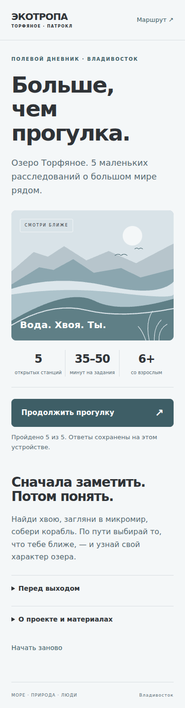

# ЭкоТропа · Торфяное

### Больше, чем прогулка

Разработка MVP для интерактивной эко-тропы для администрации района Патрокл, Владивосток. 

Мобильная научная тропа у озера Торфяное в районе Патрокла, Владивосток. Пять небольших расследований помогают увидеть за привычным пейзажем биологию, физику и связи живого мира. Посетитель наблюдает, делает выбор, читает короткую статью и получает свой игровой образ — от крепкой скалы до лёгкой на подъём бабочки.

Приложение открывается в браузере телефона или внутри Telegram. Регистрация, установка из магазина и платные сервисы не нужны.

[Для администрации и партнёров](docs/PROJECT.md) · [Добавить станцию](docs/ADD_STATION.md) · [Научная редактура](docs/SOURCES.md) · [Фотографии и лицензии](docs/ASSETS.md) · [Проверки](docs/TESTING.md)

---



## Что внутри

| Станция | Что делает посетитель | Что узнаёт |
|---|---|---|
| **01 · Озеро в несколько этажей** | Выбирает место для утки и наблюдает за водоёмом | Укрытия, коллективная бдительность, плавательный пузырь и фильтрация |
| **03 · Невидимый город Торфянки** | Отличает природные прототипы от придуманного героя | Пищевые связи и жизнь в масштабе капли |
| **05 · Хвойное расследование** | Ищет четыре признака, по желанию фотографирует находки | Чем отличаются сосна, ель, пихта и можжевельник |
| **08 · Почему стальной корабль не тонет** | Перемещает детали, испытывает судно или смотрит рабочий пример | Сила Архимеда, центр тяжести и продольный баланс |
| **10 · Два мира стрекозы** | Наблюдает, читает историю, отвечает «правда / ложь» | Водная личинка, экзувий, метаморфоз и различия зрения |

Станции 2, 4, 6, 7 и 9 остаются явно обозначенными будущими точками. Финал открывается после **пяти доступных станций**, без ожидания остальных.

**Станция 8 не блокирует чтение.** Кнопка перехода к статье и рабочий пример доступны с самого начала. После первой неудачи, в том числе при неполной сборке, сразу появляется объяснение и предложение читать дальше.

## Запустить на Mac / Linux

Нужен Python **3.12+**. Команда на macOS — `python3`, а не `python`.

```bash
cd eco-trail
python3 -m venv .venv
source .venv/bin/activate
python3 -m pip install -r requirements.txt
python3 run.py
```

Открой **http://localhost:8000**. Остановка — `Ctrl+C`.

На Windows активация окружения: `.venv\Scripts\activate`; при необходимости вместо `python3` используй `py -3.12`.


## Подключить Telegram Mini App

1. Создай бота через **@BotFather → `/newbot`** или выбери существующего.
2. Сначала проверь, что **HTTPS-адрес приложения** открывается на телефоне.
3. У @BotFather отправь **`/setmenubutton`**, выбери бота, укажи адрес приложения и подпись, например **«Открыть экотропу»**. Также доступен путь **Bot Settings → Menu Button**.
4. По желанию настрой основное мини-приложение через **Bot Settings → Configure Mini App**.
5. Открой бота на телефоне и нажми кнопку меню.

Используется тот же HTTPS-адрес, что и в обычном браузере. Вручную вставлять токен бота в JavaScript или `.env` приложения **не требуется**. SDK Telegram используется для раскрытия окна, цвета интерфейса, кнопки назад и тактильного отклика; отказ SDK не блокирует прохождение.

## Как считаются результаты

У персонажа пять черт: **опора, открытость, внимание, замысел, связь**. Каждый ответ в `choice` или `profile_choice` добавляет веса из поля `scores`. Ответ записывается по паре `станция:блок`; повторный клик не добавляет очки, смена ответа заменяет старый выбор.

Для каждой черты сумма делится на сумму её максимально возможных баллов в отвеченных вопросах. Это уменьшает перекос из-за разного количества баллов в вариантах. В финале показаны исходные числа и полоски нормированного результата. При точном равенстве приложение сообщает о смешанном образе; порядок отображения равных результатов фиксирован: скала, бабочка, цапля, стрекоза, сосна.

Отдельно начисляются **научные открытия**: до 4 за распознавание микрожителей и до 5 за «правда / ложь». Вопросы учитывают первый подтверждённый ответ. Ошибки сразу объясняются, путь дальше остаётся открытым. На личностный образ эти баллы не влияют.

Это развлекательный тест с прозрачной логикой.

## Открыть следующую станцию

Отредактируй соответствующий `app/stations/station_XX.py`: `status: 'active'`, содержимое `blocks`, связки `next_block_id` и `completion`. Или добавь новый файл `station_11.py` с объектом `STATION`. После перезапуска сервера станция автоматически появится в маршруте, подсчёте прогресса и условиях финала.

Менять HTML, JavaScript или список импортов не нужно, если используются существующие механики. Для принципиально нового типа игры понадобится новый рендерер — это честная граница расширяемости. [Контракт и готовый пример](docs/ADD_STATION.md).

**Озеро. Природа. Люди.** Технология здесь нужна для того, чтобы чаще смотреть по сторонам.
